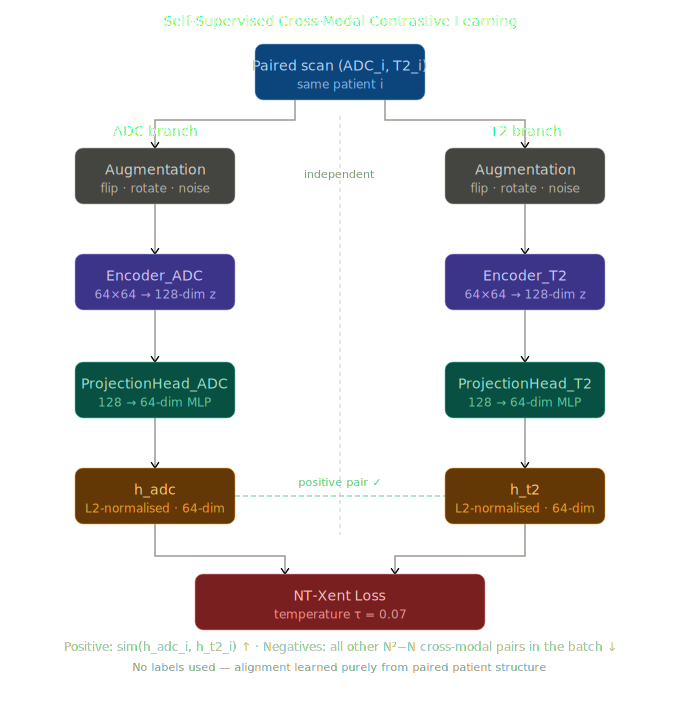

# Bi-Modality Medical Image Synthesis
### Semi-Supervised Sequential GAN + Self-Supervised Contrastive Learning — PyTorch Implementation

> PyTorch port and extension of **"Bi-modality Medical Image Synthesis using Semi-supervised Sequential Generative Adversarial Networks"**
> IEEE Journal of Biomedical and Health Informatics, 2019.
> Original paper: [IEEE Xplore](https://ieeexplore.ieee.org/document/8736809)

---

## What This Project Does

Given a patient's **ADC (Apparent Diffusion Coefficient)** prostate MRI scan, this project explores two approaches to cross-modal medical image understanding:

### 1. Semi-Supervised Sequential GAN *(paper implementation)*
Synthesises the corresponding **T2-weighted MRI** scan from an ADC scan — without needing a fully paired dataset. Combines:
- A small set of **paired** images → supervised L1 reconstruction loss
- A large set of **unpaired** images → unsupervised WGAN-GP adversarial loss

### 2. Self-Supervised Contrastive Learning *(mini-project extension)*
Learns a **shared embedding space** across ADC and T2 modalities using NT-Xent (InfoNCE) contrastive loss — with **no labels at all**. The model learns what makes an ADC and T2 scan belong to the same patient by:
- Pulling embeddings of paired (ADC, T2) scans together
- Pushing embeddings of all other combinations apart

| | Semi-Supervised GAN | Self-Supervised Contrastive |
|---|---|---|
| **Output** | Synthesised images | Embedding vectors |
| **Labels needed** | Paired images only | None |
| **Evaluated by** | PSNR / SSIM / FID | Retrieval accuracy |
| **Practical use** | Generate T2 from ADC | Cross-modal retrieval, downstream classification |

---

## Platform Support

| Platform | CPU | GPU |
|---|---|---|
| **Windows** | ✅ | ✅ CUDA (NVIDIA) |
| **Mac (Apple Silicon)** | ✅ | ✅ MPS (M1/M2/M3) |
| **Mac (Intel)** | ✅ | ✅ CUDA (if available) |
| **Linux** | ✅ | ✅ CUDA (NVIDIA) |

The code automatically detects the best available device (CUDA → MPS → CPU).

> **PowerShell** (default on Windows 10/11): use backtick `` ` `` for multi-line commands.
> **Command Prompt** (cmd.exe): use `^` for multi-line commands.
> **Simplest option**: put everything on one line — works in any terminal.

---

## Project Structure

```
Multimodal-Medical-Image-Synthesis/
├── pytorch_port/
│   ├── models.py               ← All network architectures (8 classes)
│   ├── dataset.py              ← Datasets for single, paired, augmented, and labeled data
│   ├── utils.py                ← WGAN-GP penalty, image saving, device helpers
│   ├── preprocess_dicom.py     ← Convert raw DICOM → 64x64 PNG
│   │
│   ├── train_semi.py           ← Semi-supervised WGAN-GP + L1 training
│   ├── test_semi.py            ← Semi: random generation + real ADC → T2 inference
│   │
│   ├── train_self.py           ← Self-supervised NT-Xent contrastive training
│   ├── test_self.py            ← Self: cross-modal retrieval + linear probe evaluation
│   │
│   ├── evaluate.py             ← Unified evaluation: both models + TensorBoard comparison
│   ├── requirements.txt        ← Python dependencies
│   │
│   ├── results_semi_real/      ← Semi training checkpoints + TensorBoard logs
│   ├── results_self/           ← Self training checkpoints + TensorBoard logs
│   ├── generated_semi_real/    ← Images generated during semi training
│   ├── test_output_semi/       ← Semi inference outputs
│   ├── test_output_self/       ← Self retrieval outputs
│   └── eval_output/            ← Unified evaluation: CSVs, charts, TensorBoard
│
├── data/
│   ├── adc/                    ← 500 ADC PNG images (64×64)
│   ├── t2/                     ← 500 T2 PNG images (64×64)
│   ├── paired_names.txt        ← 200 paired filenames (supervised signal)
│   ├── adc_names.txt           ← 500 ADC filenames (unsupervised signal)
│   └── t2_names.txt            ← 500 T2 filenames (unsupervised signal)
│
├── assets/                     ← Architecture diagrams
├── semi/                       ← Original TensorFlow 1.x semi-supervised code
├── supervise/                  ← Original TensorFlow 1.x supervised code
├── unsupervise/                ← Original TensorFlow 1.x unsupervised code
├── BIMODAL.pdf                 ← Research paper
├── Project_Report.pdf          ← Full project report with results
└── README.md
```

---

## Requirements

```
Python >= 3.8
torch >= 2.0
torchvision
numpy
opencv-python
tensorboard
Pillow
scikit-image
scipy
pydicom
```

---

## Step-by-Step Execution

### Step 1 — Clone the Repository

```bash
git clone https://github.com/avijit004/Multimodal-Medical-Image-Synthesis.git
cd Multimodal-Medical-Image-Synthesis
```

> **Important:** The repo uses Git LFS for images and model files.
> Run this after cloning to download them:
> ```bash
> git lfs install
> git lfs pull
> ```

---

### Step 2 — Install PyTorch

Go to **https://pytorch.org/get-started/locally/** and select your config.

**Mac (Apple Silicon or Intel):**
```bash
pip install torch torchvision
```

**Windows / Linux with NVIDIA GPU (CUDA 12.1):**
```bash
pip install torch torchvision --index-url https://download.pytorch.org/whl/cu121
```

**Windows / Linux CPU only:**
```bash
pip install torch torchvision --index-url https://download.pytorch.org/whl/cpu
```

---

### Step 3 — Install Remaining Dependencies

```bash
cd pytorch_port
pip install numpy opencv-python tensorboard Pillow scikit-image scipy pydicom
```

---

### Step 4 — Preprocess DICOM to PNG *(Optional)*

> **Skip this step** — the `data/` folder with 500 ADC + 500 T2 images is already included.
> Only needed if regenerating from raw PROSTATEx DICOM files.

1. Download PROSTATEx: **https://www.cancerimagingarchive.net/collection/prostatex/**
2. Use NBIA Data Retriever to convert `.tcia` → DICOM
3. Run:
```bash
python preprocess_dicom.py
```

---

## Part A — Semi-Supervised GAN

### Step 5 — Train the Semi-Supervised Model

```bash
python train_semi.py \
    --adc_dir ../data/adc \
    --t2_dir ../data/t2 \
    --paired_list ../data/paired_names.txt \
    --adc_list ../data/adc_names.txt \
    --t2_list ../data/t2_names.txt \
    --results_path ./results_semi_real \
    --save_image_path ./generated_semi_real \
    --iters 10000 \
    --batch_size 32 \
    --n_critic 3 \
    --save_interval 500
```

**Windows PowerShell:**
```powershell
python train_semi.py `
    --adc_dir ../data/adc `
    --t2_dir ../data/t2 `
    --paired_list ../data/paired_names.txt `
    --adc_list ../data/adc_names.txt `
    --t2_list ../data/t2_names.txt `
    --results_path ./results_semi_real `
    --save_image_path ./generated_semi_real `
    --iters 10000 `
    --batch_size 32 `
    --n_critic 3 `
    --save_interval 500
```

| Argument | Default | Description |
|---|---|---|
| `--iters` | 5000 | Training iterations |
| `--batch_size` | 32 | Batch size |
| `--z_dim` | 128 | Latent vector dimension |
| `--lr` | 1e-4 | Learning rate |
| `--n_critic` | 3 | Discriminator updates per generator step |
| `--save_interval` | 500 | Save checkpoint every N iterations |
| `--use_cpu` | False | Force CPU |

**Monitor training:**
```bash
tensorboard --logdir ./results_semi_real
```
Open **http://localhost:6006** → IMAGES tab → drag the slider to watch image quality improve over iterations.

---

### Step 6 — Run Semi-Supervised Inference

```bash
python test_semi.py \
    --checkpoint ./results_semi_real/<timestamp>/Saved_models/semi_ckpt_final.pt \
    --mode both \
    --adc_dir ../data/adc \
    --adc_list ../data/adc_names.txt \
    --n_samples 50 \
    --output_dir ./test_output_semi
```

| Mode | Description |
|---|---|
| `random_pairs` | Generate synthetic ADC+T2 pairs from random noise z ~ N(0,I) |
| `real_to_fake` | Real ADC → Encoder → Generator → Reconstructed ADC + Synthesised T2 |
| `both` | Run both modes |

**Output:**
```
test_output_semi/
├── random_pairs/
│   ├── adc/    ← synthetic ADC images
│   └── t2/     ← corresponding synthetic T2 images
└── real_to_fake/
    ├── input_adc/          ← real ADC input
    ├── reconstructed_adc/  ← encoder → decoder round-trip
    └── synthesized_t2/     ← THE MAIN RESULT
```

---

## Part B — Self-Supervised Contrastive Learning

### Step 7 — Train the Self-Supervised Model

```bash
python train_self.py \
    --adc_dir ../data/adc \
    --t2_dir ../data/t2 \
    --paired_list ../data/paired_names.txt \
    --results_path ./results_self \
    --iters 10000 \
    --batch_size 32
```

**Windows PowerShell:**
```powershell
python train_self.py `
    --adc_dir ../data/adc `
    --t2_dir ../data/t2 `
    --paired_list ../data/paired_names.txt `
    --results_path ./results_self `
    --iters 10000 `
    --batch_size 32
```

| Argument | Default | Description |
|---|---|---|
| `--iters` | 10000 | Training iterations |
| `--batch_size` | 32 | Batch size |
| `--z_dim` | 128 | Encoder output dimension |
| `--proj_dim` | 64 | Projection head output dimension |
| `--lr` | 1e-4 | Learning rate |
| `--temperature` | 0.07 | NT-Xent temperature τ |
| `--save_interval` | 1000 | Save checkpoint every N iterations |
| `--use_cpu` | False | Force CPU |

**What you will see during training:**
```
iteration:0
NT-Xent Loss  = 3.7594
Top-1 Acc     = 3.1%

iteration:5000
NT-Xent Loss  = 0.1006
Top-1 Acc     = 96.9%

iteration:9950
NT-Xent Loss  = 0.0064
Top-1 Acc     = 100.0%
```

**Monitor training:**
```bash
tensorboard --logdir ./results_self
```

---

### Step 8 — Run Self-Supervised Evaluation

```bash
python test_self.py \
    --checkpoint ./results_self/<timestamp>/Saved_models/self_ckpt_final.pt \
    --mode retrieval \
    --adc_dir ../data/adc \
    --t2_dir ../data/t2 \
    --paired_list ../data/paired_names.txt \
    --output_dir ./test_output_self
```

| Mode | Description |
|---|---|
| `retrieval` | For every ADC image, rank all T2 images by cosine similarity — report Top-1/3/5 accuracy |
| `linear_probe` | Freeze encoders, train a linear classifier on concatenated embeddings (needs labeled lists) |

---

## Part C — Unified Evaluation and Comparison

### Step 9 — Run Unified Evaluation

Evaluates both models on the same data, compares them, and writes everything to a single TensorBoard:

```bash
python evaluate.py \
    --semi_checkpoint ./results_semi_real/<timestamp>/Saved_models/semi_ckpt_final.pt \
    --self_checkpoint ./results_self/<timestamp>/Saved_models/self_ckpt_final.pt \
    --adc_dir ../data/adc \
    --t2_dir ../data/t2 \
    --paired_list ../data/paired_names.txt \
    --adc_list ../data/adc_names.txt \
    --t2_list ../data/t2_names.txt \
    --output_dir ./eval_output
```

**Windows PowerShell:**
```powershell
python evaluate.py `
    --semi_checkpoint ./results_semi_real/<timestamp>/Saved_models/semi_ckpt_final.pt `
    --self_checkpoint ./results_self/<timestamp>/Saved_models/self_ckpt_final.pt `
    --adc_dir ../data/adc `
    --t2_dir ../data/t2 `
    --paired_list ../data/paired_names.txt `
    --adc_list ../data/adc_names.txt `
    --t2_list ../data/t2_names.txt `
    --output_dir ./eval_output
```

**Outputs saved to `eval_output/`:**
```
eval_output/
├── semi_per_image_metrics.csv   ← per-image MAE/MSE/PSNR/SSIM for semi model
├── eval_summary.csv             ← summary of all metrics, both models
├── comparison_chart.png         ← side-by-side bar chart
└── tensorboard/                 ← TensorBoard event files
```

---

### Step 10 — View Results in TensorBoard

```bash
tensorboard --logdir ./eval_output/tensorboard
```

Open **http://localhost:6006**

| TensorBoard Tab | What you see |
|---|---|
| **SCALARS** | `Semi/` — MAE, PSNR, SSIM, FID for ADC and T2 |
| | `Self/` — Top-1, Top-3, Top-5 retrieval accuracy, Mean Rank |
| **IMAGES** | `Semi/ADC/` — real vs reconstructed ADC |
| | `Semi/T2/` — real vs synthesised T2 |
| | `Semi/Comparison/` — side-by-side interleaved grids |
| | `Semi/Generated/` — random noise → ADC+T2 pairs |
| **DISTRIBUTIONS** | Per-image PSNR and SSIM histograms |
| **PROJECTOR** | `Self/Embeddings_ADC_vs_T2` — ADC and T2 embeddings in 3D, coloured by modality |
| **TEXT** | `Comparison/Summary_Table` — full markdown comparison table |
| **FIGURES** | `Comparison/Summary_Chart` — bar chart comparing both models |

---

## Results

Trained on PROSTATEx dataset (500 ADC + 500 T2 images, 200 paired).

### Semi-Supervised GAN — 9,500 iterations

| Metric | ADC Reconstruction | T2 Synthesis |
|---|---|---|
| MAE | 34.92 ± 5.30 | 106.65 ± 19.94 |
| MSE | 2022.92 ± 608.69 | 15294.23 ± 4832.37 |
| PSNR | 15.26 ± 1.29 dB | 6.55 ± 1.63 dB |
| SSIM | 0.1329 ± 0.033 | 0.0297 ± 0.054 |
| FID | 309.92 | 350.80 |

> Low SSIM on T2 synthesis is expected — ADC and T2 are fundamentally different image contrasts and do not share pixel values even for the same anatomy. The original paper trains for 40,000 iterations on a larger dataset; results improve significantly with more training.

### Self-Supervised Contrastive — 10,000 iterations

| Metric | Value |
|---|---|
| Top-1 Retrieval Accuracy | **100.0%** |
| Top-3 Retrieval Accuracy | **100.0%** |
| Top-5 Retrieval Accuracy | **100.0%** |
| Mean Rank | **1.0 / 200** |

> NT-Xent loss converged from **3.76 → 0.006**. The model correctly identifies the paired T2 for every ADC query — rank 1 every time. Evaluated using the projection-head outputs (the space explicitly aligned during training).

---

## Architecture Overview

### Semi-Supervised GAN (6 networks)




| Network | Role |
|---|---|
| `SharedLayers` | Shared decoder layers between both generators — ensures spatial consistency across modalities |
| `Encoder` | Real ADC image → 128-dim latent vector |
| `GeneratorADC` | 128-dim noise/code → 64×64 ADC image |
| `GeneratorT2` | 64×64 ADC image → 64×64 T2 image (U-Net with skip connections) |
| `DiscriminatorADC` | WGAN critic for ADC images |
| `DiscriminatorT2` | WGAN critic for T2 images |

### Self-Supervised Contrastive (4 networks)




| Network | Role |
|---|---|
| `Encoder` (ADC) | ADC image → 128-dim embedding |
| `Encoder` (T2) | T2 image → 128-dim embedding |
| `ProjectionHead` (ADC) | 128-dim → 64-dim projected embedding for NT-Xent loss |
| `ProjectionHead` (T2) | 128-dim → 64-dim projected embedding for NT-Xent loss |

The two projection heads are trained to make `proj(enc_adc(ADC_i))` and `proj(enc_t2(T2_i))` close for the same patient `i`, and far apart for all other combinations in the batch.

---

## Original TensorFlow Code

The original TF 1.x implementation is preserved in:
- `semi/` — semi-supervised training (the paper's focus)
- `supervise/` — fully supervised training
- `unsupervise/` — fully unsupervised training

---

## Citation

```bibtex
@article{yi2019bimodal,
  title={Bi-modality Medical Image Synthesis Using Semi-supervised Sequential Generative Adversarial Networks},
  author={Yi, Xin and Walia, Ekta and Babyn, Paul},
  journal={IEEE Journal of Biomedical and Health Informatics},
  year={2019}
}
```

---

## References

- Paper: https://ieeexplore.ieee.org/document/8736809
- Dataset: https://www.cancerimagingarchive.net/collection/prostatex/
- NBIA Data Retriever: https://wiki.cancerimagingarchive.net/display/NBIA/Downloading+TCIA+Images
- PyTorch Install: https://pytorch.org/get-started/locally/
